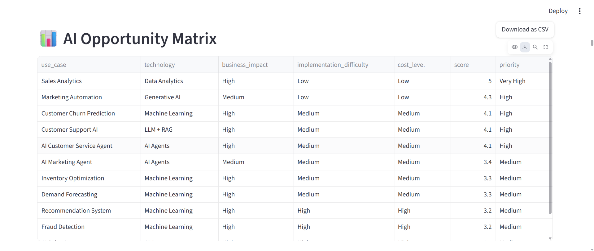
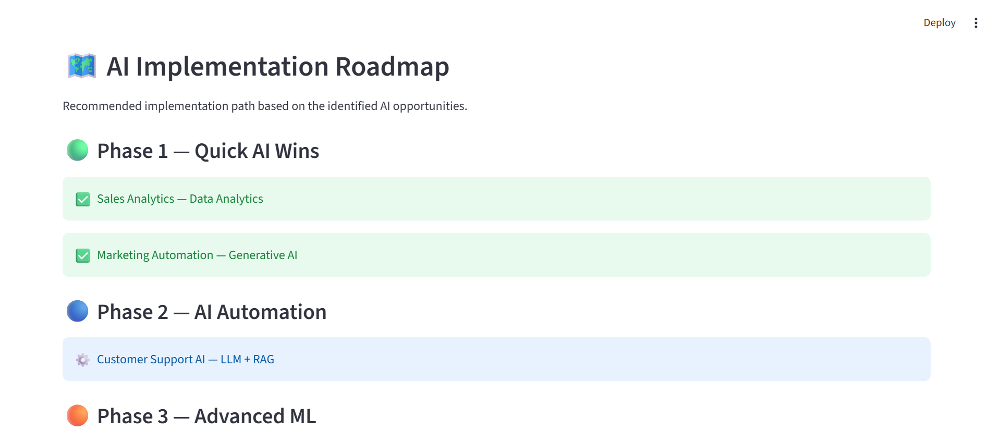
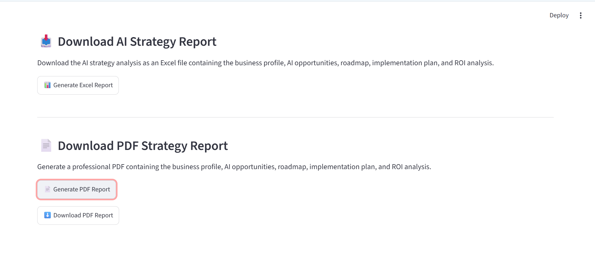

# AI Strategy Consultant

An AI-powered business strategy platform that analyzes a company's business profile and recommends suitable AI use cases, implementation priorities, roadmap phases, implementation plans, and estimated ROI.

## Features

- Business profile analysis
- AI use-case discovery
- AI opportunity scoring
- AI Opportunity Matrix
- AI implementation roadmap
- AI implementation plans
- AI cost and ROI analysis
- AI Agent recommendations
- Excel report generation
- PDF report generation
- Automated tests

## AI Use Cases

The platform currently analyzes opportunities such as:

- Sales Analytics
- Marketing Automation
- Customer Support AI
- Demand Forecasting
- Inventory Optimization
- Customer Churn Prediction
- Recommendation Systems
- Fraud Detection
- AI Customer Service Agent
- AI Sales Agent
- AI Marketing Agent
- AI Inventory Agent

## AI Roadmap

The platform organizes recommendations into four phases:

1. **Phase 1 — Quick AI Wins**
2. **Phase 2 — AI Automation**
3. **Phase 3 — Advanced ML**
4. **Phase 4 — AI Agents**

## Project Architecture

add text
Business Profile
       ↓
AI Use-Case Dataset
       ↓
Opportunity Engine
       ↓
Scoring Engine
       ↓
AI Opportunity Matrix
       ↓
Roadmap Engine
       ↓
Implementation Engine
       ↓
ROI Engine
       ↓
PDF / Excel Reports

--Technology Stack
Python
Streamlit
Pandas
ReportLab
OpenPyXL
Git
GitHub

--Project Structure

ai-strategy-consultant/
│
├── ai/
├── app/
│   └── main.py
│
├── data/
│   └── ai_use_cases.csv
│
├── models/
│
├── reports/
│   ├── pdf_report_generator.py
│   ├── report_generator.py
│   ├── AI_Strategy_Report.pdf
│   └── AI_Strategy_Report.xlsx
│
├── strategy/
│   ├── opportunity_engine.py
│   ├── scoring_engine.py
│   ├── roadmap_engine.py
│   ├── implementation_engine.py
│   └── roi_engine.py
│
├── tests/
│
├── fonts/
│
├── requirements.txt
└── README.md

## Live Demo

Try the deployed AI Strategy Consultant:

👉 [Open AI Strategy Consultant](https://ai-strategy-consultant-m4zwcxrqudzgqzbtvmzgjv.streamlit.app/)

##  Screenshots

###  AI Strategy Dashboard

###  AI Opportunity Matrix

###  AI Implementation Roadmap

###  PDF and Excel Report Generation

--Reports

The platform can generate:

AI Strategy PDF Report
Excel Strategy Report

The reports contain:

Business analysis
AI Opportunity Matrix
AI roadmap
Implementation plans
Investment estimates
Annual benefit estimates
ROI analysis
Strategic conclusion

Author:

Varun H M

GitHub:
https://github.com/varunhm24